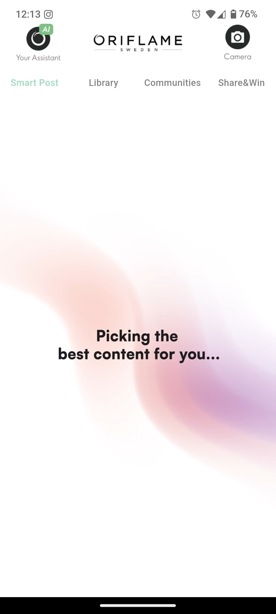
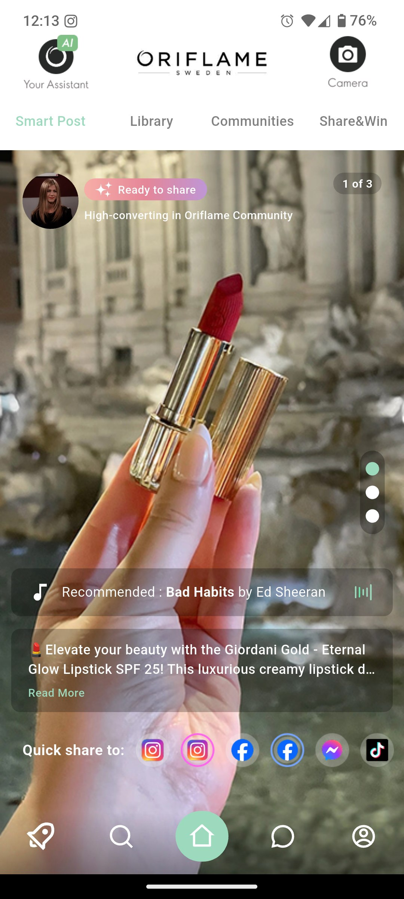
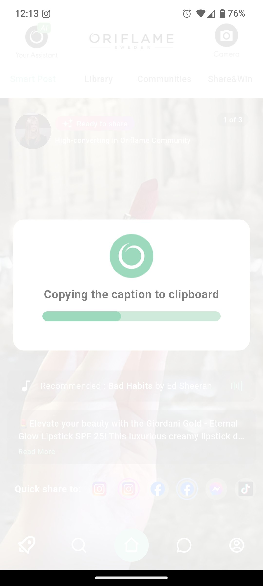
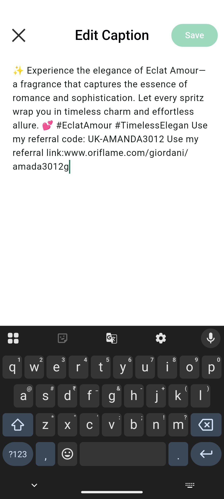

<p align="center">
  
</p>

<h1 align="center">Brandie Task</h1>

<p align="center">
  A clean and responsive Flutter UI based on a real-world Figma design challenge.
</p>

---

## 📱 Preview
### <a href="https://drive.google.com/file/d/101R7rsr05dnNXziP53X9JKTnn9dIhENv/view?usp=sharing"><ins>Full Video Demo</ins></a>


### Quick GIF Demo
'

### Screenshots
'
'
'
'
'
---

## 🚀 Getting Started
> Commands to run the application
- `flutter pub get`
- `flutter run`


---

## 🎯 Task Objective

- How well the Figma design is translated into a working Flutter UI

- Code structure and reusable component practices

- Attention to UI/UX details and styling

- Logical use of theming and best practices

- Ability to handle ambiguous or missing design details with thoughtful decisions

---

## 📋 Assumptions

- The screen shown in the Figma design belongs to the Home section

- The currently selected bottom navigation icon should be highlighted to indicate active state

- Since the post’s icons are white, a black tint background is added to ensure they remain visible over white images/videos (similar to Instagram’s approach)

- The vertical circular page indicator should remain fixed on screen while scrolling through posts for a better user experience

- Captions should have "Read more" and "Read less" buttons; when expanded, an “Edit Caption” option becomes visible

- When entering the “Edit Caption” screen, the status bar icons are hidden — assuming the screen goes full-screen in this state

---

## 📂 Folder Structure

 ```
lib/
│
├── core/                         # Global modules, constants, themes, utils, widgets  
│   ├── constants/  
│   ├── helper/  
│   ├── model/  
│   ├── theme/  
│   ├── utils/  
│   └── widgets/  
│  
└── features/                     # Feature-based structure  
    ├── bottom_nav/              # Bottom navigation and its tabs  
    │   ├── controllers/         # Bottom nav level logic  
    │   └── bottom_tabs/  
    │       ├── home_tab/  
    │       │   ├── controllers/  
    │       │   └── home_tab.dart  
    │       ├── chat_tab/  
    │       │   ├── controllers/  
    │       │   └── chat_tab.dart  
    │       └── ...              # Other tabs  
    └── ...                      # Other features/screens  

``` 

---

## 📦 Dependencies
### Flutter SDK
- `flutter`
- `cupertino_icons`

### Utils
- `flutter_screenutil`
- `logger`

### Navigation & Notification
- `url_launcher`

### Media (Image, Permission, Video)
- `video_player`
- `permission_handler`
- `flutter_svg`
- `readmore`

### State Management
- `get`

### Additional UI Elements (Toast, Popup, Addition Display)
- `fluttertoast`
- `flutter_animate`
- `flutter_native_splash`
- `flutter_launcher_icons`
- `rename`


---

## 🤝 Contact

Created by **Ruchi Sharma**  
[LinkedIn](https://www.linkedin.com/in/ruchi-s-211436223/) • [GitHub](https://github.com/sharmaruchi30) • [Email](mailto:sharma101ruchi@email.com)


